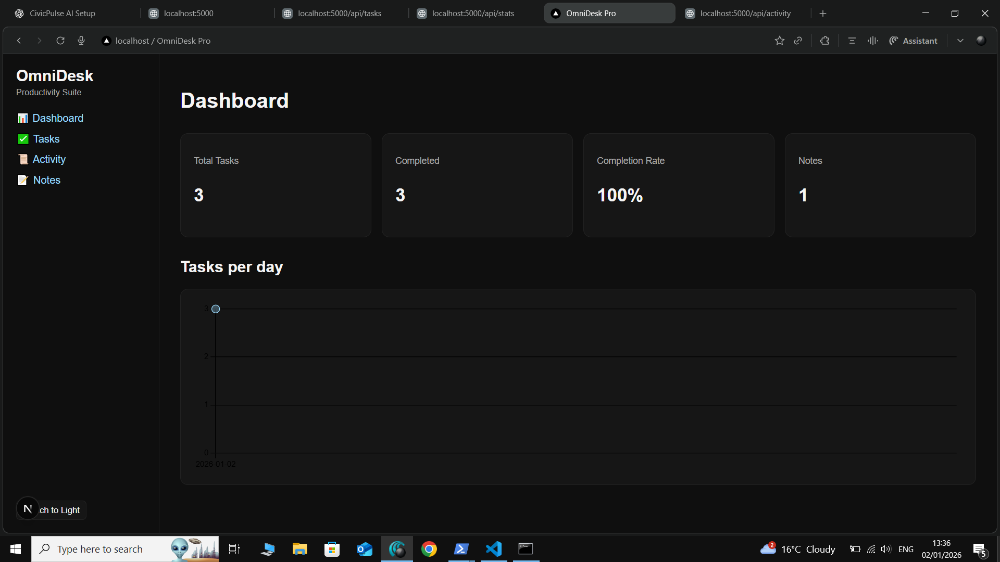
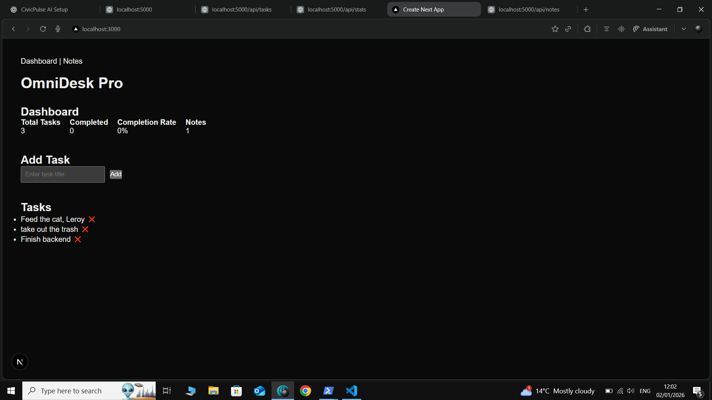
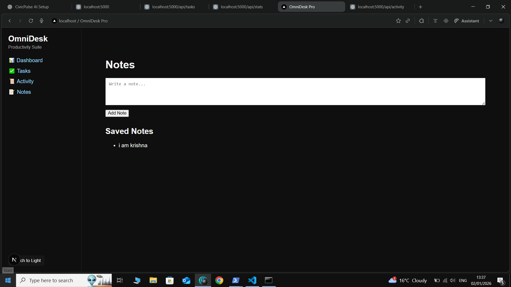
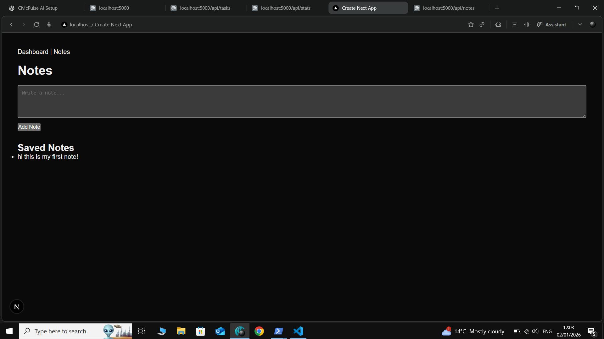

# OmniDesk Pro 🚀

A full-stack productivity dashboard built with **Next.js**, **Node.js**, and **SQLite**.

OmniDesk Pro provides task management, note-taking, and real-time analytics powered by a custom backend API.

---

## ✨ Features

### Dashboard
- Create and view tasks
- Live productivity statistics
- Completion rate calculation
- Persistent data storage

### Notes
- Create and view notes
- Notes count reflected in dashboard stats

### Backend
- REST API built with Express
- SQLite database (file-based, persistent)
- Real analytics computed server-side

---

## 🛠 Tech Stack

### Frontend
- Next.js (App Router)
- React
- Fetch API

### Backend
- Node.js
- Express
- SQLite
- CORS enabled

---

## 📊 API Endpoints

### Tasks
- `GET /api/tasks` – Fetch all tasks
- `POST /api/tasks` – Create a task
- `PUT /api/tasks/:id` – Mark task as completed

### Notes
- `GET /api/notes` – Fetch all notes
- `POST /api/notes` – Create a note

### Analytics
- `GET /api/stats` – Get real-time productivity stats

---

## ▶️ How to Run Locally

### Backend
```bash
cd backend
npm install
node server.js


Runs on http://localhost:5000
---


### Frontend
```bash
d frontend
npm install
npm run dev


Runs on http://localhost:3000


---

## 📸 3️⃣

1. Dashboard page
2. Notes page


```md




